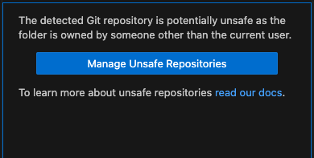

# Project Description

Description of project...

# Prerequisites

To eliminate any inconsistencies through different environments (i.e. Windows, macOS, or Linux), a `Dockerfile` is provided which builds an image containing all dependencies for this project. This will give you a Docker container with a fully working local environment, regardless of the host operation system.

To utilize this workflow, [Docker](https://docs.docker.com/get-docker/) will need to be installed on your local machine.

# File Structure

Once you've cloned the repository from Git, the file structure will look as follows:

```
.
├── README.md
├── __test__
│   └── home.test.tsx
├── app
│   ├── favicon.ico
│   ├── globals.css
│   ├── layout.tsx
│   ├── page.module.css
│   └── page.tsx
├── commitlint.config.js
├── components
│   ├── atoms
│   └── templates
├── next-env.d.ts
├── next.config.js
├── package-lock.json
├── package.json
├── public
│   ├── next.svg
│   └── vercel.svg
├── tree.txt
├── tsconfig.json
└── vitest.config.ts

```

The general file structure follows the [Next.js Project Structure](https://nextjs.org/docs/getting-started/project-structure) generated by the seed project. For business component break down, refer to the components below:

Document any business specific components here...

# Run in Docker Container

The repository is set up to utilize the [Dev - Containers](https://marketplace.visualstudio.com/items?itemName=ms-vscode-remote.remote-containers) extension for an easy and efficient development environment set up. Follow the steps below to setup the Docker container.

### First Time Setup

1. Make sure that the [Dev - Containers](https://marketplace.visualstudio.com/items?itemName=ms-vscode-remote.remote-containers) extension is installed on VSCode.
2. Open the root directory of the project in VSCode.
3. Run the `Dev Containers: Rebuild and Reopen in Container` command from the Command Palette.
4. This will run the `.devcontainer/devcointainer.json` file which is the main configuration entry point for the Docker setup.
5. A new window will open once the image is build. The new window is the development environment within the Docker container.
6. Once in the container on first build, all `npm` dependencies will be installed.
7. When the `npm` dependencies are complete, Open a new terminal window and run `npm run dev`
8. The application should be running on [http://localhost:3000](http://localhost:3000).

### Launch Existing Container

If you have already setup the Docker container previously, then the only requirement is to run `Dev Containers: Reopen in Container` command from the Command Palette. This will open the workspace in VS Code. From here you can continue working as if on the host machine.

# Getting Started

This is a [Next.js](https://nextjs.org/) project bootstrapped with [`create-next-app`](https://github.com/vercel/next.js/tree/canary/packages/create-next-app).

First, run the development server:

```bash
npm run dev
```

Open [http://localhost:3000](http://localhost:3000) with your browser to see the result.

You can start editing the page by modifying `app/page.tsx`. The page auto-updates as you edit the file.

This project uses [`next/font`](https://nextjs.org/docs/basic-features/font-optimization) to automatically optimize and load Inter, a custom Google Font.

# Unit Tests

To run the unit tests, execute the following command in a separate terminal window:

```bash
npm run test
```

Document how unit testing is run and structured here...

# Troubleshooting

The following section will help troubleshoot some common scenarios you may face when working with the project.

### Changes are not showing in VS Code explorer inside docker container (left pane)

If `git` is not showing changes to unstaged files on the explorer, then the repository might be identified as an `unsafe repository`. This is happening because the repository was originally cloned on the host machine, and in the process of building the containter, the `.git` folder was copied over to the docker container. To solve this, follow the steps below:

1. Select the `Source Control` icon on the left pane.
2. Press the `Manage Unsafe Repositories` as shownin the screenshot below.



3. Select the current workspace from the prompted list.

## Learn More

To learn more about Next.js, take a look at the following resources:

- [Next.js Documentation](https://nextjs.org/docs) - learn about Next.js features and API.
- [Learn Next.js](https://nextjs.org/learn) - an interactive Next.js tutorial.

You can check out [the Next.js GitHub repository](https://github.com/vercel/next.js/).

## Deploy on Vercel

The easiest way to deploy your Next.js app is to use the [Vercel Platform](https://vercel.com/new?utm_medium=default-template&filter=next.js&utm_source=create-next-app&utm_campaign=create-next-app-readme) from the creators of Next.js.

Check out our [Next.js deployment documentation](https://nextjs.org/docs/deployment) for more details.
